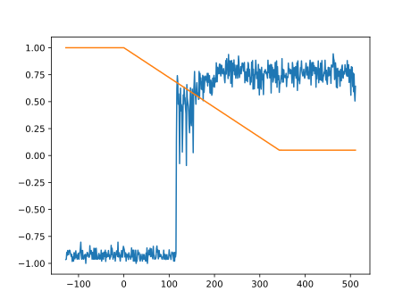

# Q-learning and Double-Deep-Q-Networks for 2-Player-Durak

Training and testing parameters are set in main.py

To start the container:

AMD:
```
sudo docker compose up -d tensorboard 
sudo docker compose run --rm amd-trainer
```

Nvidia:
```
sudo docker compose up -d tensorboard 
sudo docker compose run --rm nvidia-trainer
```

## Q-Learning:

Manual CPU implementation based on dynamically growing Q-Value-Tables

## Double-Deep-Q-Networks:

Implementation basen on the reference implementation by [Ray](https://github.com/ray-project/ray/tree/master/rllib/algorithms/dqn)

Action masking implemented as custom TorchRLModule

GPU-accelerated via PyTorch

## Environment:

Parallel PettingZoo environment

Perfect public knowledge tracking for played cards:

```python
class Status(IntEnum):
    Unknown = 0
    MyCard = 1
    OpponentCard = 2
    OpenAttack = 3
    DefendedAttack = 4
    Defense = 5
    InDeck = 6
    Discarded = 7
```

Observation space:

```python
gym.spaces.Dict(
    {
        "observations": gym.spaces.MultiDiscrete(
            [len(Status)] * self.num_cards  # All cards
            + [len(CardColor)]  # Trump color
            + [len(Phase)]  # Current phase
            + [2]  # Is attacker (0 or 1)
            + [2]  # Is active player (0 or 1)
            + [self.num_cards + 1]  # Own hand size (0..36)
            + [self.num_cards + 1]  # Opponent hand size (0..36)
            + [self.num_cards + 1]  # Draw pile size (0..36)
        ),
        "action_mask": gym.spaces.MultiBinary(self.num_cards + 1), # 36 cards + pass action
    }
)
```

Action space:

```python
gym.spaces.Discrete(self.num_cards + 1) # Pass == 36
```

## Results (WIP):

DDQN vs. uniformly random opponent:

