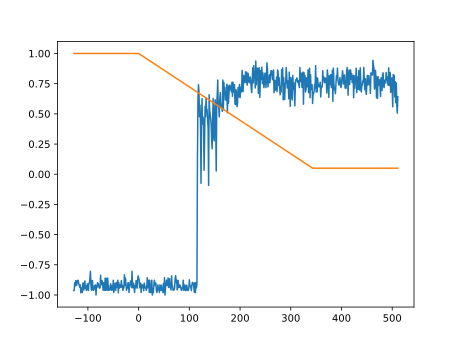

# Double-Deep-Q-Networks Trainer für 2-Spieler-Durak

Die Trainings- und Testparameter werden in main.py festgelegt

Der Container wird gestartet via:

AMD:
```
sudo docker compose up -d tensorboard
sudo docker compose run --rm amd-trainer
```

Nvidia:
```
sudo docker compose up -d tensorboard
sudo docker compose run --rm nvidia-trainer
```

## Double-Deep-Q-Networks:

Implementierung auf Basis der Referenzimplementierung von [Ray](https://github.com/ray-project/ray/tree/master/rllib/algorithms/dqn)

Action-Masking implementiert als benutzerdefiniertes TorchRLModule

GPU-beschleunigt über PyTorch

## Umgebung:

Parallele PettingZoo-Umgebung

Perfekte Nachverfolgung des öffentlichen Wissens über gespielte Karten:

```python
class Status(IntEnum):
    Unknown = 0
    MyCard = 1
    OpponentCard = 2
    OpenAttack = 3
    DefendedAttack = 4
    Defense = 5
    InDeck = 6
    Discarded = 7
```

Beobachtungsraum:

```python
gym.spaces.Dict(
{
"observations": gym.spaces.MultiDiscrete(
[len(Status)] * self.num_cards  # Alle Karten
+ [len(CardColor)]  # Trumpffarbe
+ [len(Phase)]  # Aktuelle Phase
+ [2]  # Ist Angreifer (0 oder 1)
+ [2]  # Ist aktiver Spieler (0 oder 1)
+ [self.num_cards + 1]  # Eigene Handgröße (0..36)
+ [self.num_cards + 1]  # Handgröße des Gegners (0..36)
+ [self.num_cards + 1]  # Größe des Nachziehstapels (0..36)
),
"action_mask": gym.spaces.MultiBinary(self.num_cards + 1), # 36 Karten + Pass-Aktion
}
)
```

Aktionsraum:

```python
gym.spaces.Discrete(self.num_cards + 1) # Pass == 36
```

## Ergebnisse:

DDQN Episodenrewards gegen gleichverteilt zufälligen Gegner:

